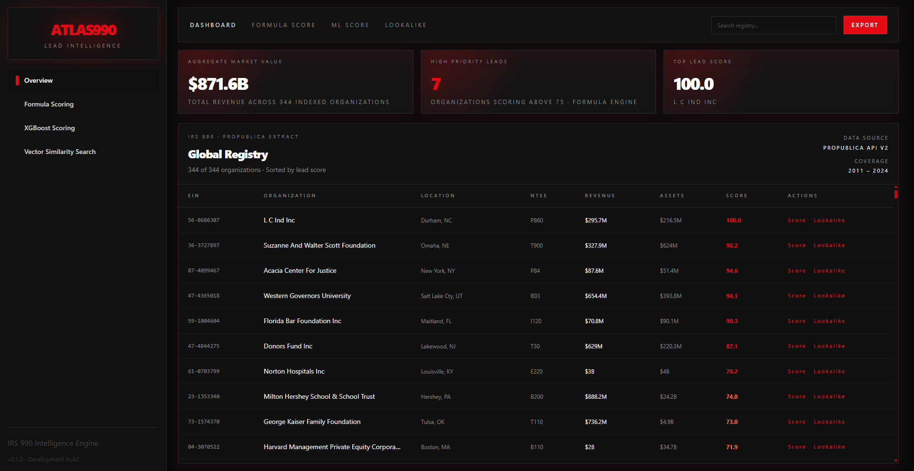
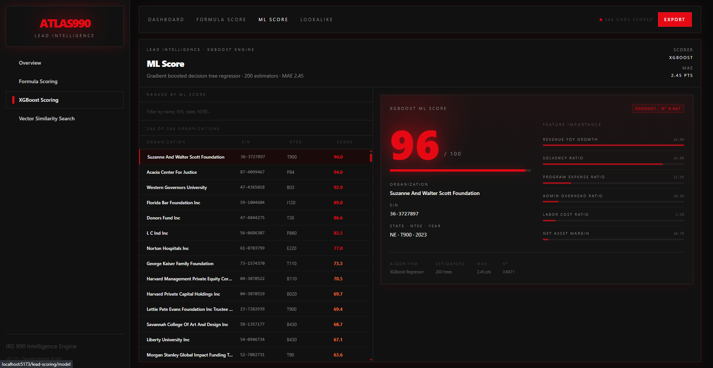
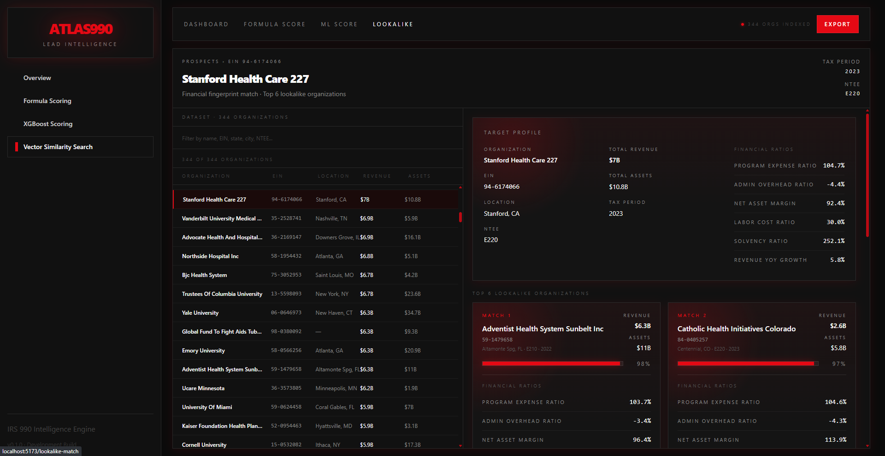

# Atlas990

## Overview

A full-stack web application built with React and FastAPI that cleans raw public IRS Form 990 tax data into an optimized Parquet format. It uses an XGBoost model to calculate a 0–100 priority score for nonprofit leads and integrates Meta's FAISS library to instantly find matching lookalike organizations via vector similarity search.

#### [Try it yourself!](https://atlas990.vercel.app)

Note: this app is designed for desktop/tablet viewing and is not optimized for mobile.

## App Areas
- Overview Page: the main registry view with summary metrics, searchable rows, and range-based CSV export

- Formula Scoring: the rule-based scoring view for lead prioritization
- Model Scoring: the XGBoost-backed scoring view for predicted lead quality

- Lookalike Match: the vector similarity search view for finding and exporting twin organizations

## Key Features
- Cleaned IRS Form 990 data stored in an optimized Parquet pipeline
- Formula scoring and model scoring for prioritizing leads
- Vector similarity search for identifying similar organizations
- CSV export flows for overview, scoring, and lookalike workflows
- Modular modal-based export interactions across pages
- Desktop-oriented layout with dense tables, summary cards, and action controls

## Tech Stack
- Frontend: React, Vite, React Router, TypeScript
- Backend API: FastAPI, Uvicorn
- Data and modeling: Pandas, NumPy, PyArrow, scikit-learn, XGBoost, FAISS
- Export layer: CSV generation from the frontend utility helpers

## Repository Layout
- `backend/` - FastAPI application, routers, pipelines, and model/data assets
- `frontend/` - React app, components, pages, and CSV export utilities
- `backend/app/pipelines/` - data extraction, transformation, scoring, and similarity tooling
- `frontend/src/pages/` - dashboard, scoring, and lookalike pages
- `frontend/src/components/` - shared shell, cards, nav, and modal components

## Notes
- The UI is intentionally optimized for desktop/tablet-style viewing, not small mobile screens.